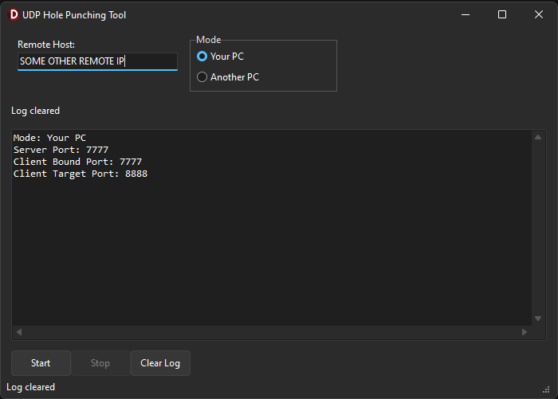

# 📡 UDP Hole Punching Tool

This repository showcases a Delphi-based **UDP Hole Punching Tool** utilizing Indy components. It enables UDP-based communication between two PCs, allowing them to establish a direct connection behind NAT (Network Address Translation) using the hole punching technique.

## 📋 Project Overview
- **Single Application**: A Delphi application that acts both as a server and a client for UDP hole punching.
- **Server Functionality**: Listens for incoming UDP packets and helps establish the connection between two clients.
- **Client Functionality**: Sends messages to the server, receives responses, and establishes a peer-to-peer connection through UDP hole punching.

## ✨ Features
- **Role Selection**: Choose between "Your PC" or "Another PC" to configure the correct ports for UDP communication.
- **UDP Hole Punching**: Facilitates NAT traversal and establishes communication between two PCs.
- **Real-time Logging**: Logs UDP messages exchanged during the connection setup.
- **Dynamic Port Configuration**: Server and client ports adjust based on the selected role.

## ⚙️ Installation
1. **Requirements**: Delphi IDE and Indy components.
2. **Clone & Open Project**: Clone this repository and open the `.dpr` file in Delphi.
3. **Compile**: Build the project to generate the executable.
4. **Run**: Start the server, the client is auto configured to work for you!

## 🔌 Usage
1. **Server Setup**: Launch the server to listen for incoming connections on the configured port.
2. **Client Connection**: Enter the server’s IP address, then start the connection.
3. **UDP Hole Punching**: The server helps establish a peer-to-peer connection between two clients, even if they are behind NAT.

## 🤝 Contributing
Fork, modify, and submit a pull request with improvements or fixes!

## 📜 License
This project is open-source under the MIT License.

## 📧 Contact
For feedback or questions, open an issue or contact me directly "Discord: bitmasterxor"

Built with ❤️ By BitmasterXor using Delphi / Embarcadero Rad Studio

